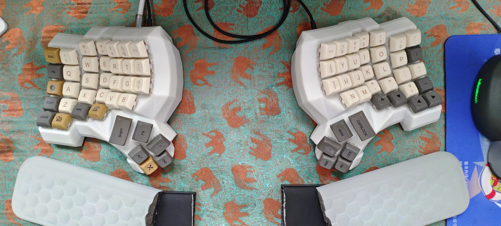

# 使用说明

**注意：**
千万不要在 USB 带电的情况下 **插拔** 音频线！！！
千万不要在 USB 带电的情况下 **插拔** 音频线！！！
千万不要在 USB 带电的情况下 **插拔** 音频线！！！

## 键盘使用

1. 先连接音频线，插到底，
2. USB 线连接到左手，
3. 附带的胶贴用于粘贴键帽，将按键变为盲键，
4. 键盘较高建议准备合适手托，因为是曲面键盘有倾斜角度的手托更舒服（图上我自己的手托底下垫高）。
5. 千万不要与普通键盘混用，布局不一致影响形成肌肉记忆，
6. 为尽快适应新键盘可以每天练习一下打字和正确指法。打字练习：<https://www.typedojo.com/typing-lesson/>

**个人感受：** 现在连续长时间打字左手不会再抽筋，因为不会像普通键盘一样别着左手。打字速度和稳定性都有提升。另外大部分快捷键只用左手键盘即可实现，并且按键过程中不需要手指从字母区移开。

others：
[键盘布局](键盘布局.md)
[QMK 烧录](QMK%20烧录.md)
